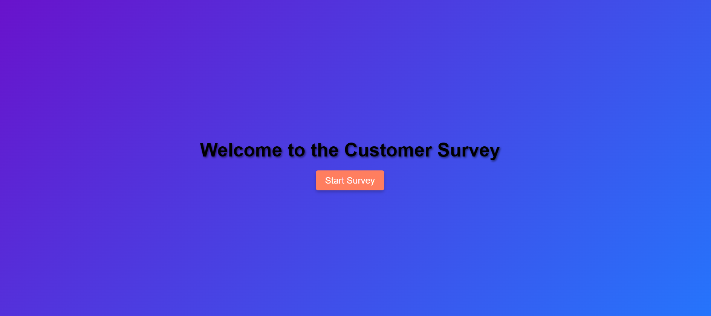
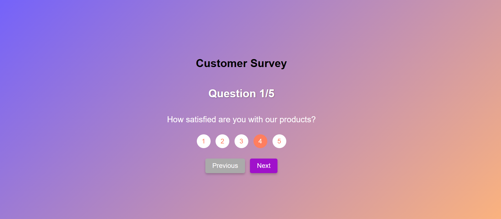
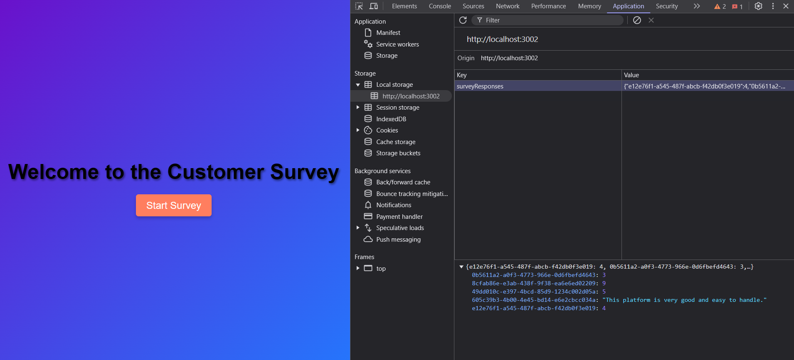

<b>Customer Survey Application</b>

This is a customer survey application where users are asked a series of questions, and their responses are saved in localStorage. The survey can be navigated with next and previous buttons, and users can skip questions if they wish. Upon completion of the survey, a confirmation dialog asks the user to submit their responses, and a "Thank You" screen is displayed.

Features:
Users can answer multiple questions with different types (rating and text).
Responses are saved in localStorage with unique identifiers for each question.
Users can navigate between questions using "Previous" and "Next" buttons.
Users can skip questions if they prefer.
A session ID is generated for each user to track responses.
On survey completion, users are asked for confirmation to submit their responses.
A "Thank You" screen is shown at the end of the survey.
The application can dynamically handle the addition of new questions.

Survey Flow:
The user is greeted with a Welcome Screen and can start the survey by clicking the Start button.
The survey consists of a set of questions, and the user can navigate between questions.
The user can skip a question or go back to previous ones.
After completing the survey, the user is asked to confirm submission.
Once confirmed, the survey is marked as COMPLETED in localStorage, and a "Thank You" message is displayed.

How to View Responses:
Open your browser’s Developer Tools (Ctrl + Shift + I or F12).
Go to the Application tab and under Local Storage, find your domain.
You will see keys like answer-sessionId-questionId where the answers are stored.
You can also use the console to read the stored data with localStorage.getItem('your-key').

Project Structure

/survey-app
|-- /public
|   |-- index.html            # Main HTML file
|-- /src
|   |-- /components
|   |   |-- SurveyScreen.js    # Main Survey screen component
|   |   |-- WelcomeScreen.js   # Welcome screen before the survey starts
|   |-- /assets
|   |   |-- MainScreen.css     # CSS styles for the survey screens
|   |-- App.js                # Main React component for routing
|   |-- index.js              # Entry point for React app
|-- package.json              # Project metadata and dependencies
|-- README.md                 # Project documentation (this file)

Technology Stack

Frontend:
React.js (for building UI components)
React Router (for navigation)
localStorage (for storing answers and session data)
CSS (for styling)

Backend (Optional for future enhancements):
Node.js/Express (for handling requests and saving data to a database)
MongoDB or MySQL (for storing survey data in a backend database)
Customer Survey Application

This is a customer survey application where users are asked a series of questions, and their responses are saved in localStorage. The survey can be navigated with next and previous buttons, and users can skip questions if they wish. Upon completion of the survey, a confirmation dialog asks the user to submit their responses, and a "Thank You" screen is displayed.

Features: Users can answer multiple questions with different types (rating and text). Responses are saved in localStorage with unique identifiers for each question. Users can navigate between questions using "Previous" and "Next" buttons. Users can skip questions if they prefer. A session ID is generated for each user to track responses. On survey completion, users are asked for confirmation to submit their responses. A "Thank You" screen is shown at the end of the survey. The application can dynamically handle the addition of new questions.

Survey Flow: The user is greeted with a Welcome Screen and can start the survey by clicking the Start button. The survey consists of a set of questions, and the user can navigate between questions. The user can skip a question or go back to previous ones. After completing the survey, the user is asked to confirm submission. Once confirmed, the survey is marked as COMPLETED in localStorage, and a "Thank You" message is displayed.

How to View Responses: Open your browser’s Developer Tools (Ctrl + Shift + I or F12). Go to the Application tab and under Local Storage, find your domain. You will see keys like answer-sessionId-questionId where the answers are stored. You can also use the console to read the stored data with localStorage.getItem('your-key').

Project Structure

/survey-app |-- /public | |-- index.html # Main HTML file |-- /src | |-- /components | | |-- SurveyScreen.js # Main Survey screen component | | |-- WelcomeScreen.js # Welcome screen before the survey starts | |-- /assets | | |-- MainScreen.css # CSS styles for the survey screens | |-- App.js # Main React component for routing | |-- index.js # Entry point for React app |-- package.json # Project metadata and dependencies |-- README.md # Project documentation (this file)

Technology Stack

Frontend: React.js (for building UI components) React Router (for navigation) localStorage (for storing answers and session data) CSS (for styling)

Backend (Optional for future enhancements): Node.js/Express (for handling requests and saving data to a database) MongoDB or MySQL (for storing survey data in a backend database)
